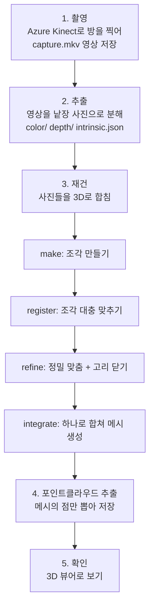

# 방을 3D로 뜨는 법 — 기초부터 차근차근 (ak3d 가이드)

> 이 문서는 **"카메라로 찍은 영상이 어떻게 3D 모델이 되는가"** 를
> 처음 보는 사람도 이해할 수 있게 설명합니다. 중간중간 우리가 실제로 쓰는
> **스크립트와 명령어**도 함께 나옵니다. 어려운 단어는 나올 때마다 풀어서 설명하고,
> 맨 끝에 [용어 사전](#12-용어-사전)도 있습니다.

---

## 0. 한 문장 요약

**Azure Kinect라는 특별한 카메라로 방을 빙 둘러 찍고, 컴퓨터가 그 수백 장의 사진을
퍼즐처럼 맞춰서 방 전체의 3차원 모습(포인트클라우드)을 만든다.**

비유하자면, 여러 각도에서 찍은 사진으로 종이 모형을 세우는 것과 비슷합니다.
단, 우리 카메라는 "거리"까지 잴 수 있어서 훨씬 정확합니다.

---

## 1. 먼저 알아야 할 기초

### 1-1. 보통 카메라 vs 우리 카메라

- **보통 카메라(RGB)**: 색(빨강 Red, 초록 Green, 파랑 Blue)만 기록합니다.
  사진을 봐도 "저 벽이 나한테서 몇 미터 떨어져 있는지"는 알 수 없죠.
- **깊이 카메라(Depth)**: 각 점이 **카메라에서 얼마나 멀리 있는지(거리)** 를 잽니다.
  마치 박쥐가 초음파로 거리를 재듯, 적외선을 쏘아 되돌아오는 시간을 재서 거리를 압니다.

두 개를 합치면 **RGB-D** (색 + 거리)가 됩니다. 이게 3D를 만드는 핵심 재료예요.

```
RGB 사진:  "이 픽셀은 파란색"
Depth:     "이 픽셀은 2.3m 떨어져 있음"
RGB-D:     "이 픽셀은 파란색이고 2.3m 떨어져 있음"  ← 3D 점 하나 완성!
```

### 1-2. Azure Kinect란?

마이크로소프트가 만든 카메라로, **RGB 카메라 + 깊이 카메라**가 한 몸에 들어 있습니다.
연구·로봇·3D 스캔에 많이 쓰입니다. 우리는 이걸로 방을 찍습니다.

### 1-3. 포인트클라우드 vs 메시 (결과물의 두 종류)

우리가 만드는 3D 결과물은 두 형태가 있습니다.

| | 포인트클라우드 (Point Cloud) | 메시 (Mesh) |
|---|---|---|
| 무엇 | **점**들의 모임 (수백만 개의 색깔 점) | 점들을 **삼각형 면**으로 이어 붙인 것 |
| 비유 | 점묘화 (점으로 그린 그림) | 종이접기처럼 면으로 덮인 표면 |
| 쓰임 | 측정, 위치 비교, SLAM 연구 | 화면에 매끈하게 보여주기, 게임/영화 |

우리 최종 목표는 **포인트클라우드**입니다.

### 1-4. "3D 재구성(Reconstruction)"이 뭐야?

여러 장의 RGB-D 사진을 **하나의 3D 공간으로 합치는 작업**입니다.
사진 한 장은 방의 "한 조각"만 보여주니까, 여러 조각을 정확히 겹쳐서
방 전체를 복원하는 거예요. 이 겹치는 과정이 이 프로젝트의 핵심입니다.

---

## 2. 핵심 개념 쉽게 이해하기

이 단어들은 뒤에서 계속 나오니 여기서 감만 잡아두세요.

- **인트린식(intrinsic, 내부 파라미터)**
  카메라의 "성격표"입니다. 렌즈의 초점거리, 중심점 같은 값이죠.
  이걸 알아야 사진의 픽셀을 실제 3D 위치로 정확히 바꿀 수 있습니다.
  다행히 Azure Kinect는 이 값을 스스로 알려줍니다 → `intrinsic.json`.

- **오도메트리(odometry, 움직임 추적)**
  연속된 사진을 비교해서 **"카메라가 그 사이 얼마나 움직였는지"** 를 계산하는 것.
  자동차 주행거리계(odometer)에서 온 말이에요.

- **프래그먼트(fragment, 조각)**
  사진 수백 장을 한 번에 맞추면 너무 힘드니까, **몇십 장씩 묶어 작은 3D 조각**을
  먼저 만듭니다. 이 조각 하나가 fragment입니다. (큰 퍼즐을 작은 구역별로 먼저 맞추기)

- **레지스트레이션(registration, 정합)**
  두 조각을 **딱 맞게 겹쳐 놓는 것**. "이 조각의 이 벽 = 저 조각의 이 벽" 하고
  같은 부분을 찾아 포갭니다.

- **루프 클로저(loop closure, 고리 닫기)** ⭐ 아주 중요
  방을 한 바퀴 돌아 **처음 위치로 돌아왔을 때**, 컴퓨터가 "아, 여기 아까 그 자리네!"
  하고 알아차려 어긋남을 바로잡는 것. 이게 안 되면 결과가 계단처럼 어긋납니다
  (뒤 [8장](#8-잘-안-될-때-실패-패턴)에서 우리가 실제로 겪음).

- **TSDF / ICP / RANSAC** (이름만 알아두면 됨)
  - **ICP**: 두 조각을 조금씩 밀고 돌려서 가장 잘 겹치는 자리를 찾는 방법.
  - **RANSAC**: 특징점(모서리 같은 눈에 띄는 부분)을 매칭해 대충 위치를 잡는 방법.
  - **TSDF**: 여러 조각을 하나의 매끈한 표면으로 합치는 저장 방식.

---

## 3. 전체 흐름 한눈에 보기



우리 방식은 **Open3D**라는 무료 라이브러리의 "Reconstruction System"을 씁니다.
GPU(그래픽카드) 없이 CPU만으로도 돌아가는 가벼운 방법이에요.

---

## 4. 준비물 (환경)

이건 최초 1번만 설치하면 됩니다.

| 준비물 | 왜 필요한가 |
|--------|-------------|
| **Azure Kinect 카메라 + SDK** | 촬영 장비와 그 드라이버·도구 |
| **Python 3.10** | 우리 스크립트를 실행하는 프로그래밍 언어 |
| **가상환경(venv) + 라이브러리** | `open3d`(3D 처리), `pyk4a`(카메라 제어), `opencv`(영상), `matplotlib` |
| **MSVC C++ Build Tools** | `pyk4a` 설치 시 컴파일(번역)에 필요 |

설치 명령은 [README.md](../README.md)의 "Setup"에 정리돼 있습니다. 요약하면:

```powershell
conda create -n o3d python=3.10   # 또는 python -m venv .venv
pip install -r requirements.txt
```

> **가상환경(venv)이 뭐야?** 프로젝트마다 라이브러리를 따로 담아두는 "전용 서랍"입니다.
> 다른 프로젝트와 버전이 섞여 충돌하는 걸 막아줘요. 우리는 `.venv` 폴더를 씁니다.

---

## 5. 폴더·파일 구조

```
C:\ak3d\
├─ config.json              재건 설정값 (숫자들)
├─ requirements.txt         필요한 라이브러리 목록
├─ README.md                영어 요약 설명
├─ RUN.md                   실행 명령어 모음 (빠른 참고용)
├─ docs\GUIDE.md            ← 지금 읽는 이 문서
├─ scripts\
│   ├─ record.py            촬영(라이브 미리보기 + 녹화) 실제 코드
│   ├─ record.ps1           촬영 실행 런처 (record.py를 띄워줌)
│   ├─ extract_mkv.py       영상 → 낱장 사진 변환
│   ├─ reconstruct.ps1      재건 4단계 실행
│   ├─ export_pointcloud.py 메시 → 포인트클라우드 변환
│   └─ view_result.py       결과를 3D 창으로 보기
├─ captures\                촬영 원본 영상 (촬영시각 폴더별로)
│   └─ 20260805_155421\capture.mkv
└─ data\myscan\             재건용 데이터와 결과물
    └─ 20260805_155421\        ← 촬영시각 폴더 (입력·중간물·결과·로그가 다 여기)
        ├─ color\           색 사진들 (000000.jpg ...)
        ├─ depth\           거리 사진들 (000000.png ...)
        ├─ intrinsic.json   카메라 성격표
        ├─ config.json      (자동생성) 이 촬영에 맞춘 재건 설정
        ├─ fragments\       (재건 중간물) 조각들
        ├─ scene\           (최종물) integrated.ply, integrated_pcd.ply
        └─ reconstruct.log  재건 실행 로그
```

---

## 6. 단계별 실행 + 스크립트 설명

> 아래 명령은 모두 `C:\ak3d`에서, 가상환경을 켠 상태로 실행합니다.
> 매 세션 시작 시:
> ```powershell
> cd C:\ak3d
> .\.venv\Scripts\Activate.ps1
> ```

### Step 1 — 촬영 🎥

```powershell
.\scripts\record.ps1 -Seconds 60
```

- **무슨 일이 일어나나:** 화면에 **실시간 카메라 창**이 뜹니다(빨간 REC 표시).
  그걸 보며 방을 천천히 한 바퀴 돕니다. `q`나 ESC를 누르면 멈추고 저장돼요.
- **결과:** `captures\촬영시각\capture.mkv` (영상 파일 하나)
- **스크립트 설명:**
  - `record.ps1` (런처): 가상환경 파이썬을 찾고, 카메라 드라이버 경로(`k4a.dll`)를
    잡아준 뒤 `record.py`를 실행합니다.
  - `record.py` (본체): 카메라를 열어 **미리보기 화면을 보여주면서 동시에 영상으로
    녹화**합니다. 참고로 Azure Kinect는 **한 프로그램만** 카메라를 쓸 수 있어서,
    "보기 앱"과 "녹화 앱"을 따로 못 켭니다. 그래서 한 프로그램이 둘 다 하도록 만든 거예요.

> 💡 촬영마다 폴더가 **촬영 시각(예: 20260805_155421)** 으로 새로 생겨서,
> 예전 촬영이 지워지지 않습니다.

### Step 2 — 추출 (영상 → 낱장 사진) ✂️

```powershell
python scripts\extract_mkv.py --input captures\20260805_155421\capture.mkv --output data\myscan\20260805_155421 --every 1
```

- **무슨 일이 일어나나:** 영상(mkv)을 한 장 한 장 사진으로 분해합니다.
  색 사진은 `color\`, 거리 사진은 `depth\`에 저장하고, 카메라 성격표
  `intrinsic.json`도 자동으로 뽑아냅니다.
- **왜 필요한가:** 재건 프로그램(Open3D)은 영상이 아니라 **낱장 사진**을 입력으로 받습니다.
- **`--every 1`**: 모든 프레임을 다 씁니다. `--every 2`면 두 장 중 한 장만(빠르지만 성김).
- **핵심 트릭:** 거리 사진을 색 사진 기준으로 딱 맞춰(정렬해) 저장하기 때문에,
  둘이 같은 카메라 성격표를 공유합니다. 그래서 `intrinsic.json`을 손으로 옮겨 적을
  필요가 없어요.

### Step 3 — 재건 (사진들을 3D로 합치기) 🧩

```powershell
.\scripts\reconstruct.ps1 -Dataset data\myscan\20260805_155421
```

이 한 줄이 내부적으로 **4단계**를 순서대로 실행합니다. 퍼즐 맞추기에 비유하면:

| 단계 | 하는 일 | 퍼즐 비유 |
|------|---------|-----------|
| **make** | 사진 40장씩 묶어 작은 3D 조각(fragment) 생성 | 구역별로 먼저 맞추기 |
| **register** | 조각들을 특징점으로 대충 겹치기 (RANSAC) | 큰 구역들을 대충 배치 |
| **refine** | 정밀하게 맞추고 **고리 닫기(loop closure)** | 딱 맞게 밀어 넣고 어긋남 보정 |
| **integrate** | 전부 하나로 합쳐 **메시** 생성 | 완성된 퍼즐을 굳히기 |

- **`-Dataset` 옵션:** "이 폴더의 데이터로 재건해줘"라는 뜻. 중간물·결과·**로그**가
  모두 그 폴더 안(`fragments\`, `scene\`, `reconstruct.log`)에 생겨서 촬영별로 깔끔히 분리됩니다.
- **결과:** `data\myscan\20260805_155421\scene\integrated.ply` (메시)
- **로그:** `data\myscan\20260805_155421\reconstruct.log` (실시간 표시 + 파일 저장).
  재건이 이상하면 이 로그에서 어느 단계가 틀어졌는지 확인.
- **시간:** 사진 수백 장 × 고해상도라 CPU로 수십 분 걸립니다. **전원 어댑터 꼭 연결!**
- **스크립트 설명:** `reconstruct.ps1`은 처음 한 번 Open3D를 인터넷에서 내려받고(clone),
  설정(config)을 그 폴더에 맞게 만들어 재건 프로그램을 돌립니다.

### Step 4 — 포인트클라우드 추출 ⭐

```powershell
python scripts\export_pointcloud.py --input data\myscan\20260805_155421\scene\integrated.ply --output data\myscan\20260805_155421\scene\integrated_pcd.ply
```

- **왜 필요한가:** 3단계의 기본 결과물은 **메시**입니다. 우리는 **포인트클라우드**를
  원하니, 메시의 **점(정점)만 뽑아** 포인트클라우드로 저장합니다.
- **용량 줄이기:** 파일이 크면 `--voxel 0.01`을 붙이세요. 1cm 격자로 점을 솎아내
  용량을 확 줄입니다(실내 방 스캔엔 충분).

### Step 5 — 확인 👀

```powershell
python scripts\view_result.py --path data\myscan\20260805_155421\scene\integrated_pcd.ply
```

3D 창이 뜨고 마우스로 돌려보며 결과를 확인합니다.
VS Code 안에서 보려면 확장 프로그램 `kleinicke.ply-visualizer`도 쓸 수 있어요
(단, 파일이 아주 크면 `view_result.py`가 더 안정적).

---

## 7. 설정값(config.json) 이해하기

재건의 "다이얼"들입니다. 몇 개만 알면 됩니다.

| 설정 | 뜻 | 팁 |
|------|-----|-----|
| `n_frames_per_fragment` | 조각 하나에 사진 몇 장 | 작을수록(예 40) 조각이 많아져 정합 기회↑ |
| `voxel_size` | 3D 격자 한 칸 크기(m) | 작을수록 정밀·느림. 방 스캔은 0.05(5cm) |
| `max_depth` | 이보다 먼 거리는 버림(m) | 3.0m 정도 (Kinect 유효 범위) |
| `icp_method` | 정밀 맞춤 방식 | `color` = 색+모양 둘 다 사용 |

---

## 8. 잘 안 될 때 (실패 패턴)

3D 스캔은 원래 까다롭습니다. 대표적 실패와 원인:

### 🪜 계단 현상 (staircase effect) — 우리가 실제로 겪음
결과가 계단처럼 어긋나 보입니다.
- **원인:** **고리 닫기(loop closure) 실패.** 방을 한 방향으로만 훑고
  **시작점으로 안 돌아오면**, 조각들을 일렬로 이어 붙이기만 해서 오차가 계속 쌓입니다.
- **실제 진단:** 우리 첫 시도에서 조각 5개가 "5 nodes, 4 edges"(일렬 체인)로만 연결되고
  고리 연결이 **0개**였습니다. 그래서 계단이 생겼어요.
- **해결:** 촬영 때 **시작 지점으로 되돌아오기** + 같은 곳을 **겹치게** 지나가기.

### ⬜ 흰 벽에서 어긋남
아무 무늬 없는 흰 벽은 컴퓨터가 "같은 곳"을 못 알아봅니다.
- **해결:** 임시로 포스터·물건을 붙여 **특징(무늬)** 을 만들어 줍니다.

### 🏛️ 천장이 돔처럼 휘고 벽에 큰 구멍 — 한 높이로 "한 바퀴만" 돌 때
loop closure는 성공해 하나의 방으로 닫혔지만, 천장이 부풀어 휘고 벽 중간이 비는 경우.
- **원인:** ① 카메라를 위로 많이 향해 **밋밋한 천장이 과하게** 잡히고(특징 부족 → 수직
  드리프트), ② NFOV **수직 화각이 좁아** 한 높이에서 벽 전체를 못 담음.
- **해결:** 카메라를 **수평·벽 방향**으로, **높이를 나눠 여러 바퀴**(틸트 위/아래) 촬영.
  [9장](#9-좋은-스캔을-위한-촬영-팁-품질의-90) 참고.

### 🕳️ 구멍 (occlusion)
가려져서 카메라가 못 본 곳은 비어 있습니다. 완전히 없앨 순 없고, 여러 각도에서
겹쳐 찍으면 줄어듭니다.

### 🪟 창문·거울
빛을 반사해 거리 측정을 망칩니다. **촬영 전에 가리세요.**

---

## 9. 좋은 스캔을 위한 촬영 팁 (품질의 90%)

### A. 궤적 (드리프트·계단 현상 방지)
1. **천천히, 부드럽게** 움직이기 (급회전 금지)
2. **시작점으로 반드시 돌아오기** ← 고리를 닫아야 어긋남이 잡힘 (실전 검증됨)
3. 같은 벽·모서리를 **겹치게** 여러 번 지나가기

### B. 카메라 방향 (벽 구멍·천장 왜곡 방지)
> 💡 한 높이로 "한 바퀴만" 돌면 천장·바닥은 잘 잡히지만 **벽 중간이 텅 비고 천장이
> 돔처럼 휘는** 문제가 생깁니다(우리가 실제로 겪음). 원인은 두 가지: ① 카메라가 위를
> 많이 향해 밋밋한 천장이 과하게 잡힘, ② NFOV의 좁은 수직 화각으로 한 높이에서는 벽
> 전체 높이를 못 담음.

4. **카메라를 수평(정면)으로, 벽을 향해** 유지. 천장·바닥만 오래 비추지 않기
   (벽은 특징이 많아 정합에 좋고, 천장은 밋밋해 왜곡을 부름).
5. **높이를 나눠 여러 바퀴** 돌기: ① 눈높이 수평 → ② 위로 살짝 틸트 → ③ 아래로 살짝
   틸트 (각 바퀴마다 시작점 복귀). 또는 걸으면서 **위아래 틸트를 섞어** 상하를 한 번에 커버.
6. 벽이 아주 높은 방이면 **WFOV**(`-DepthMode WFOV_UNBINNED`, 수직 화각이 넓음) 고려.

### C. 환경
7. 대상과 **1~3m** 거리 유지
8. 창문·거울 가리기
9. 흰 벽·밋밋한 면엔 임시 무늬(포스터·물건) 붙이기

---

## 10. 전체 명령어 요약 (복붙용)

```powershell
# 0) 환경 켜기
cd C:\ak3d
.\.venv\Scripts\Activate.ps1

# 1) 촬영 (미리보기 창 보며 방 한 바퀴, q로 정지)
.\scripts\record.ps1 -Seconds 60

# 2) 추출 (위에서 출력된 촬영 경로를 --input에)
python scripts\extract_mkv.py --input captures\<촬영시각>\capture.mkv --output data\myscan\<촬영시각> --every 1

# 3) 재건 (4단계 자동)
.\scripts\reconstruct.ps1 -Dataset data\myscan\<촬영시각>

# 4) 포인트클라우드 추출
python scripts\export_pointcloud.py --input data\myscan\<촬영시각>\scene\integrated.ply --output data\myscan\<촬영시각>\scene\integrated_pcd.ply

# 5) 보기
python scripts\view_result.py --path data\myscan\<촬영시각>\scene\integrated_pcd.ply
```

---

## 11. 우리가 실제로 해결한 문제들 (트러블슈팅 기록)

이 프로젝트를 만들며 실제로 막혔던 지점과 해결책입니다. 같은 오류를 만나면 참고하세요.

| 증상 | 원인 | 해결 |
|------|------|------|
| `k4arecorder not found` | SDK 도구가 PATH에 없음 | 스크립트가 SDK 폴더를 자동 탐색하도록 함 |
| 녹화 시 `device unavailable` | k4aviewer가 카메라를 잡고 있음 | `Stop-Process -Name k4aviewer -Force` |
| `pip install pyk4a` 빌드 실패 | C++ 컴파일러 없음 | MSVC C++ Build Tools 설치 |
| `usage: run_system.py ...` | 설정 파일 인자를 `--config`로 안 줌 | `--config` 붙이기 |
| `No module named matplotlib` | 라이브러리 누락 | `pip install matplotlib` |
| 결과가 계단 모양 | 고리 닫기 실패 | 시작점 복귀 + 겹치게 촬영 |
| 출력이 메시임(점 아님) | 기본 `--integrate`는 메시 생성 | `export_pointcloud.py`로 점 추출 |
| `UnicodeDecodeError cp949` | 설정 파일에 UTF-8 BOM이 붙음 | BOM 없이 저장하도록 수정 |

---

## 12. 용어 사전


- **RGB-D 이미지**: 컬러 이미지 $I$와, 픽셀마다 카메라 광축 방향 깊이 $Z$를 담은 깊이
  맵 $D$의 쌍. 우리 깊이는 16-bit PNG, 단위는 mm(`depth_scale=1000` → m 변환).

- **핀홀 카메라 모델 / 내부 파라미터(intrinsics) $K$**:
  3D 점을 이미지 평면으로 투영하는 선형 모델. 내부 행렬
  $K=\begin{bmatrix} f_x & 0 & c_x \\ 0 & f_y & c_y \\ 0 & 0 & 1 \end{bmatrix}$,
  ($f_x,f_y$: 초점거리[px], $c_x,c_y$: 주점). 역투영: $\mathbf{p} = Z\,K^{-1}[u,v,1]^\top$.
  우리 `intrinsic.json`은 Open3D `PinholeCameraIntrinsic` 포맷(행렬은 column-major 저장).
  Kinect가 색 카메라에 정렬된 깊이를 주므로 색 카메라 $K$ 하나만 쓴다.

- **외부 파라미터(extrinsics) / 카메라 포즈 $T \in SE(3)$**:
  월드→카메라 강체변환 $T=\begin{bmatrix} R & t \\ 0 & 1\end{bmatrix}$, $R\in SO(3)$.
  재구성이란 결국 각 프레임의 $T_i$를 추정하는 문제.

- **비주얼(RGB-D) 오도메트리**: 인접 프레임 간 상대 포즈 $T_{i,i+1}$를 광도(photometric)
  + 기하(geometric) 오차 최소화로 추정. 프레임을 이어 붙이면 누적 **드리프트**가 생김.

- **프래그먼트(fragment)**: 연속된 $N$ 프레임(`n_frames_per_fragment`)을 지역 최적화로
  묶은 부분 재구성 단위. 프레임 단위 전역 최적화의 계산량·드리프트를 억제하는 계층적 전략.

- **특징 기반 정합 + RANSAC**: 프래그먼트 다운샘플 후 **FPFH** 같은 기하 디스크립터로
  대응점을 찾고, **RANSAC**(무작위 표본으로 모델 추정, 최다 인라이어 선택)으로 이상치에
  강인한 초기 상대변환을 구함. → 전역 정합의 초기값.

- **ICP(Iterative Closest Point)**: 초기 정합을 미세조정. 최근접점 대응을 세우고
  오차(point-to-point 또는 **point-to-plane**, 여기에 색을 더한 **colored ICP**)를
  반복 최소화. 좋은 초기값이 없으면 지역해에 빠짐.

- **포즈 그래프 최적화(pose graph optimization)**: 노드=포즈($T_i$), 엣지=상대변환 측정.
  인접 엣지(odometry) + 비인접 엣지(**loop closure**)의 잔차 제곱합을 최소화(예: Gauss-Newton/
  Levenberg-Marquardt). 로그의 `nodes/edges`가 이 그래프의 크기.

- **루프 클로저(loop closure)**: 비인접 프래그먼트 간에 성립한 정합 엣지. 이것이 누적
  드리프트를 전역적으로 분산·보정. **부재 시** 그래프가 사슬(chain)이 되어 오차가 한 방향으로
  쌓임 → 계단 현상(우리 사례: 5 nodes / 4 edges, loop 엣지 0).

- **TSDF(Truncated Signed Distance Function) 적분**: 공간을 복셀로 나누고, 각 복셀에
  표면까지의 **부호 있는 거리**(절단·가중 평균)를 누적. 여러 뷰의 깊이를 융합해 노이즈를
  줄이고, Marching Cubes로 zero-crossing에서 삼각 메시를 추출. `voxel_size`가 해상도,
  `sdf_trunc`가 절단 폭.

- **복셀(voxel) / 복셀 다운샘플링**: 3D 격자 셀. 셀당 대표점 1개로 축약해 점 수·연산량을
  줄임(`export_pointcloud.py --voxel`).

- **포인트클라우드 vs 트라이앵글 메시**: 전자는 위치(+색·법선)만 갖는 점집합, 후자는 정점 +
  삼각형 연결(위상)까지 가진 표면. 표준 `--integrate`는 TSDF에서 **메시**를 추출하며,
  `save_output_as: pointcloud`는 SLAC 경로에만 적용됨(그래서 우리는 후처리로 정점을 추출).

- **법선(normal)**: 표면의 국소 방향 벡터. 셰이딩·point-to-plane ICP·일부 알고리즘의 입력.

- **드리프트(drift)**: 프레임 단위 상대추정 오차가 누적된 전역 오차. loop closure로 보정.

- **Open3D**: 우리가 쓰는 3D 처리 라이브러리. `examples/.../reconstruction_system`의
  `run_system.py`가 make/register/refine/integrate 파이프라인을 제공.

- **Matroska(.mkv) 컨테이너**: 색(MJPG)·깊이·IMU·캘리브레이션 트랙을 함께 담는 녹화 포맷
  (k4arecorder / pyk4a `PyK4ARecord` 출력).

- **가상환경(venv)**: 프로젝트 격리된 파이썬 인터프리터·의존성 트리. 전역 site-packages와의
  버전 충돌 방지.

---

*더 궁금한 부분이나 "이 스크립트가 실제로 뭘 하는지 코드 한 줄씩 보고 싶다"면
언제든 물어보세요. 이 문서는 프로젝트가 바뀌면 함께 업데이트합니다.*
